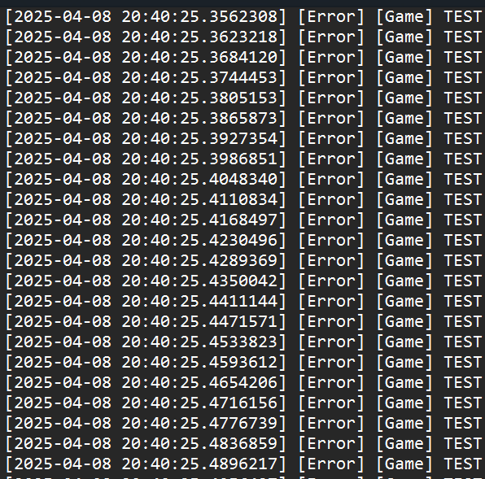
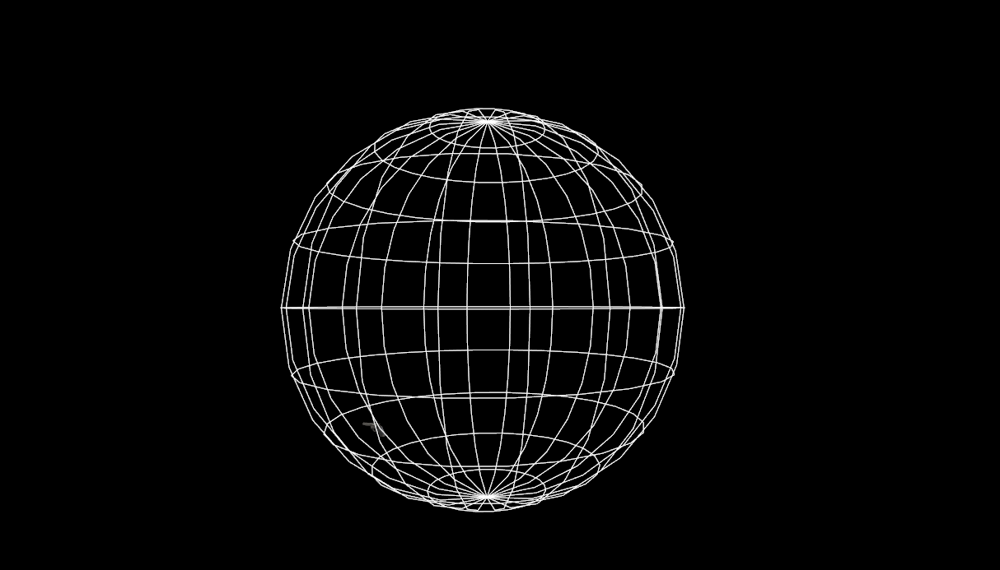

# 3D Game Engine Project

## Core

### Logging
The logger can log in the console and a file using different log priority levels and categories. Priority of logging can be adjusted to skip logging all levels below set level. Colors of the console logs are configurable.

The file logging has a configurable file size, before it rotates to the next file. Currently it simply keeps a single backup. If a full backup is stored and the new rotation happens, the backup is overwritten with the new file. The file also contains the log level more clearly and is timestamped.

```cpp
// logging can be done using the LOG macro or using the specifc _Priority level macro.
ME_LOG(MauCor::LogPriority::Error, MauCor::LogCategory::Game,"test {}", 1000);
ME_LOG_ERROR(MauCor::LogCategory::Game, "TEST");
```

Example of console logging (Renderer category, info & trace log level)


Example of file logging (contains time stamp, category & log level)


I do plan on supporting adding custom categories in the future (similar to Unreal Engines system).

### Debugging - Asserts
- Assert only triggers in debug, the message is an optional parameter that will be logged to the console / file logger.
- Check triggers in all builds, message is an optional parameter that will be logged to the console / file logger.
- Verify logs a warning in release builds, fails in debug. This means code in the macro is still executed in release. Message is an optional parameter that will be logged to the console / file logger.

| Macro       | Build Type  | Fails on Condition? | Removed in Release? | Use Case									|
|-------------|-------------|---------------------|---------------------|-------------------------------------------|
| ME_ASSERT	  | Debug-only  | Yes (fatal)         | Yes                 | Catching programmer errors				|
| ME_CHECK    | All builds  | Yes (fatal)         | No                  | Critical runtime invariants				|
| ME_VERIFY   | All builds* | No (log only)*      | No*                 | Validate logic without halting execution  |

```cpp
// Some assert examples
ME_ASSERT(std::filesystem::exists("Path123.txt"));
ME_CHECK(pRenderer, "Renderer must be valid");
ME_VERIFY(CalculateAndValidatePath(), "Path must be valid");
```

## Engine

## Renderer

### Coordinate System
In this project, we use a right-handed 3D coordinate system with the following conventions:
**X-axis:** Represents the horizontal direction.
- Positive X moves to the right.
- Negative X moves to the left.

**Y-axis:** Represents the vertical direction (with Y-up convention).
- Positive Y moves upward.
- Negative Y moves downward.

**Z-axis**: Represents the depth direction.
- Positive Z moves forward (towards the camera's view).
- Negative Z moves backward (away from the camera's view).

### Debug Rendering
Easy to use API for debug rendering.

```cpp
void GameScene::Tick()
{
	Scene::Tick();

	// start, end, colour
	DEBUG_RENDERER.DrawLine({0, 0,0 },  {0, 100, 100} );
	DEBUG_RENDERER.DrawLine({-10 , 10, -10}, {10, 10, 10}, { 0, 1, 0});

	// center, radius, colour, segmenets (per circle), layers
	DEBUG_RENDERER.DrawSphereComplex({20,20,20}, 20.f, { 1, 1, 1 }, 24, 10);
}
```

Result of that last example is this: 


